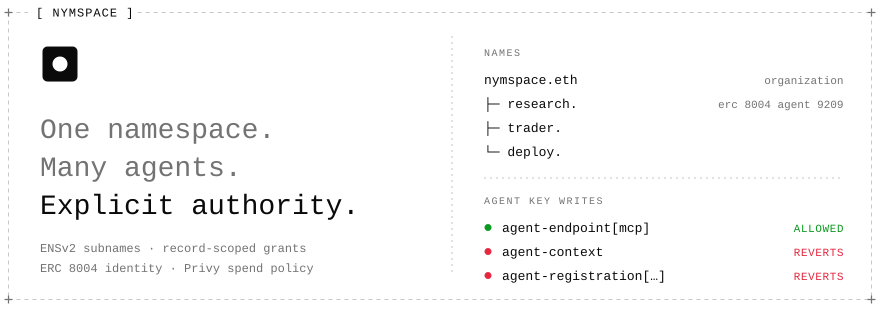

<!-- Header layout after github.com/terkelg/terkelg: strips floated left and
     stacked, each a <picture> choosing a light or a dark SVG. Two files per
     strip rather than one SVG with a prefers-color-scheme media query: GitHub
     strips <style> from rendered SVG, so an image that switches its own fill
     works in a browser tab and turns invisible here. The zero-height data:
     images are line breaks between floats; <br clear="left"> hands the page
     back to normal flow. Regenerate with `node .github/readme/generate.mjs`.
     The build-log strip is the exception: .github/workflows/readme-activity.yml
     redraws it from the commit history and hosts it on the readme-assets
     branch, which is why its URLs are absolute. -->
<picture>
  <source media="(prefers-color-scheme: dark)" srcset=".github/readme/top-dark.svg">
  
</picture>

<a href="./docs/15_DEMO_SCRIPT.md">
  <picture>
    <source media="(prefers-color-scheme: dark)" srcset=".github/readme/link-demo-dark.svg">
    
  </picture>
</a>
<a href="./docs/04_SYSTEM_ARCHITECTURE.md">
  <picture>
    <source media="(prefers-color-scheme: dark)" srcset=".github/readme/link-architecture-dark.svg">
    
  </picture>
</a>
<a href="#onchain-evidence">
  <picture>
    <source media="(prefers-color-scheme: dark)" srcset=".github/readme/link-evidence-dark.svg">
    
  </picture>
</a>
<a href="#run-it-locally">
  <picture>
    <source media="(prefers-color-scheme: dark)" srcset=".github/readme/link-run-dark.svg">
    
  </picture>
</a>

<picture>
  <source media="(prefers-color-scheme: dark)" srcset=".github/readme/hero-dark.svg">
  
</picture>
<a href="https://github.com/musashi0x/nymspace/commits">
  <picture>
    <source media="(prefers-color-scheme: dark)" srcset="https://raw.githubusercontent.com/musashi0x/nymspace/readme-assets/activity-dark.svg">
    
  </picture>
</a>
<br clear="left">

Nymspace lets an organization run AI agents under an ENSv2 namespace, delegate
exactly which identity records each agent may change, verify its ERC 8004
identity and live trust data through The Graph, and cap its spending with
Privy policies.

Built for [ETHOnline 2026](https://ethglobal.com/events/ethonline2026).

## The problem

Agents already have names, ERC 8004 registrations, MCP endpoints, wallets and
reputation, but nothing ties them together with an authority model. Give an
agent its identity key and it can rewrite everything about itself. Withhold it
and a human has to approve every endpoint change.

Nymspace makes ENSv2 that authority model. The organization owns the parent
name, each agent is a subname, and the resolver grants an agent's key write
access to one record rather than to the whole name.

## What the demo shows

Three live agents on ENSv2 Sepolia: `research.nymspace.eth`,
`trader.nymspace.eth` and `deploy.nymspace.eth`.

1. **Scoped delegation.** The agent's own key updates its `agent-endpoint[mcp]` record.
2. **A real refusal.** The same key tries to rewrite the ENSIP 25 identity
   binding, and the resolver contract reverts with `EACUnauthorizedAccountRoles`.
3. **Verified identity.** The name is bound via ENSIP 25 to ERC 8004 agent 9209
   on Base Sepolia, and the binding is checked at runtime.
4. **Live discovery.** The Agent0 subgraph is queried live and a model ranks
   the results. Every citation it makes is validated against the response.
5. **Spending policy.** A Privy server wallet makes one payment inside its
   policy. An over-limit payment is denied before anything is broadcast.
6. **Console chat.** A Google ADK agent routes a question to one of eight live
   reads. The model picks the read; the answer comes from the read.

Script and timings: [`docs/15_DEMO_SCRIPT.md`](./docs/15_DEMO_SCRIPT.md).

## Sponsor tracks

| Track | How Nymspace uses it |
|---|---|
| **ENS** | ENSv2 subnames, record-scoped delegation through a PermissionedResolver, ENSIP 26 records, ENSIP 25 binding verified at runtime |
| **The Graph** | Live Agent0 ERC 8004 queries, with an LLM ranking whose every citation is checked against the response |
| **Privy** | One amount policy on a server wallet; an allowed and a denied payment in the same run, limit read from the live policy |
| **Google ADK** | A tool-calling agent that routes console questions to live reads and writes no part of the answer |

Each proof is a gate that runs against the real systems, not fixtures.

```
+--------------- [ SPONSOR GATES ] ----------------+
|                                                  |
| [x]  ens         gate a  10/10                   |
| [x]  the graph   gate b   7/7                    |
| [x]  privy       gate c  10/10                   |
| [x]  google adk  gate f  10/10                   |
| [x]  google adk  gate g   7/7                    |
|                                                  |
+--------------------------------------------------+
```

Full requirement mapping: [`docs/16_SPONSOR_QUALIFICATION.md`](./docs/16_SPONSOR_QUALIFICATION.md).

## Architecture


```
                    nymspace.eth  (ENSv2 Sepolia · 11155111)
                          │
                UserRegistry proxy 0xd0D823…
                          │
        ┌─────────────────┼─────────────────┐
   research.           trader.           deploy.
        │
        │  PermissionedResolver 0x45DaD5…  (one resolver, all three names)
        │     agent-context             ← organization writes
        │     agent-endpoint[mcp]       ← controller writes  (record-scoped grant)
        │     agent-registration[…]     ← organization only  (ENSIP 25)
        │
        ├──── ERC 8004 IdentityRegistry 0x8004A8…  (Base Sepolia · 84532)
        │       agent 9209, registration file claims research.nymspace.eth
        │            │
        │            └── Agent0 subgraph ──→ discovery, ranked by Gemini
        │
        └──── Privy wallet 0x310207…  under one amount policy
```

The resolver row carries the design. `agent-endpoint[mcp]` is granted to the
agent's controller for one record, so the same key is refused on
`agent-context` and on the ENSIP 25 binding by the contract itself, not by an
application check.

More diagrams (request workflow, every service) are in [`diagram/`](./diagram).

## Onchain evidence

All hashes come from committed gate artifacts under `evidence/` and
`packages/*/evidence/`.

| What | Chain | Hash |
|---|---|---|
| Register `research.nymspace.eth` | Sepolia | `0x77948c09394877467ad77c178f966cd006b08077739d7d90a5b13dd91c83744f` |
| Grant `SET_TEXT` on `agent-endpoint[mcp]` | Sepolia | `0x036a463931f93d47b5dbb86004cedf11f0668f2ced6b6b33437e99c9d53d9c35` |
| ERC 8004 registration (agent 9209) | Base Sepolia | `0x1750f2f5c77d7b3c951cd0a1ab41a40a42f444bb73081e5376a8c9d588528c9f` |
| ENSIP 25 record, organization-signed | Sepolia | `0xb05d7c58e114299d38fd4d73628df4a365561a7b2ed9467e5be09d9600abf715` |
| Controller write, permitted | Sepolia | `0x5cf1b408e93816c0486ebd51845c50096fc0542c63e0fd42908595a99307f110` |
| Revoke, then re-grant | Sepolia | `0x233d5583…` / `0x4189dc01…` |
| Payment executed inside policy | Base Sepolia | `0xff4989cdae039f5a7e75b13be49b7b6eda9198c13e75321b74c852cb24b99ded` |

The two denials have no hashes, and that is the point. A denial that reached a
chain would not be a denial.

**A deliberate trade-off.** The organization keeps root roles on the parent
registry, so it can reclaim any agent subname. An organization that cannot
revoke a compromised agent's identity has handed over authority it can never
take back. ENSv2 calls the opposite state emancipation; Nymspace is the state
before it.

## Run it locally

Needs Node, pnpm 10 and Docker.

```bash
pnpm install
docker compose up -d                       # postgres on 5433
pnpm --filter @nymspace/store db:migrate
pnpm sync:fleet
pnpm dev                                   # web on :3111, api on :3112
```

Then open <http://localhost:3111/console>. None of the steps above needs a
private key. The full walkthrough is
[`docs/23_LOCAL_DEMO_RUNBOOK.md`](./docs/23_LOCAL_DEMO_RUNBOOK.md).

To reproduce the onchain proofs yourself, copy `.env.example` to `.env`, fill
in the keys ([`docs/19_ENV_AND_CONFIG.md`](./docs/19_ENV_AND_CONFIG.md)), then:

```bash
pnpm check:credentials                     # Gate 0: every provider, real round trip
pnpm provision:fleet                       # three subnames, records, record-scoped grants
pnpm register:identity                     # ERC 8004 + ENSIP 25 binding
pnpm provision:wallet                      # Privy wallet under one amount policy
pnpm verify:acceptance                     # Gates A-D, three consecutive clean runs
```

## Repository layout

Two apps share one set of packages. Domain logic lives in `packages/*` and is
never reimplemented in an app, so a change in the ENSv2 beta has one blast
radius.

```
+----------------- [ WORKSPACE ] ------------------+
|                                                  |
| nymspace                                         |
| ├─ apps                                          |
| │  ├─ web       next.js console     :3111        |
| │  └─ api       hono, /v1 routes    :3112        |
| └─ packages                                      |
|    ├─ core      types, public env                |
|    ├─ ens       ensv2 reads, writes              |
|    ├─ graph     agent0 subgraph                  |
|    ├─ privy     wallet, policy                   |
|    ├─ adk       console chat router              |
|    ├─ github    build log feed                   |
|    └─ store     postgres coordination            |
|                                                  |
+--------------------------------------------------+
```

`@nymspace/store` holds labels, provisioning progress and cached snapshots. It
is not an authority: identity, permissions, trust and spend policy are read
from their own systems on every request
([`docs/09_DATA_AND_EVENT_MODEL.md`](./docs/09_DATA_AND_EVENT_MODEL.md)).

## How it was built

Spec-driven: every feature started as a spec in [`docs/`](./docs) and a change
proposal in [`openspec/`](./openspec) before any code. AI coding assistants
were used during development.

The build log at the top of this page is drawn from this repository's own
commit history by [`scripts/draw-readme-activity.ts`](./scripts/draw-readme-activity.ts),
from the same read as the landing page's, and redrawn twice a day.

## License

MIT
